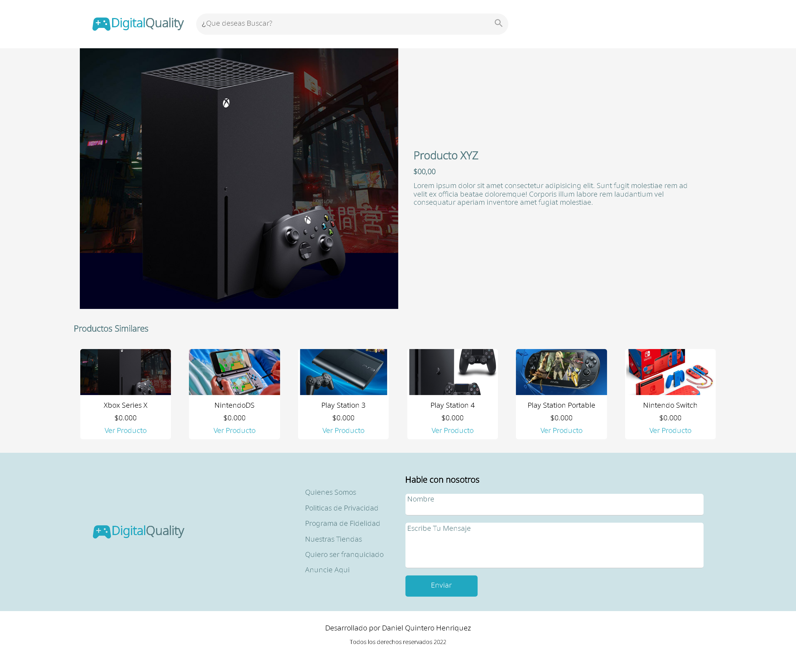
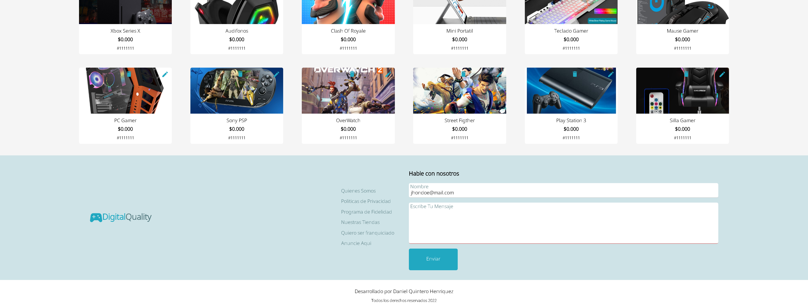

### E-Comerce - Programa One Oracle Next Education

:v: Los invito a dar un vistazo a esta demostracion del repositorio y no se olviden escribir cualquier duda o comentario.

## [Demo]()

## :smiley: Hola A Todos

:point_right: Presento mi proyecto para este segundo challenge del programa Oracle Next Education en asociacion con Alura; Este segundo challenge consistia en desarrollar las distintas interfaces de un E-Comerce estas interfaces debian ser responsive desing.

;

:point_right: En mi solucion hice algunos ligeros cambios en la presentacion primero opte por cambiar la combinacion de colores, tambien cambie la presentacion de los articulos pues me gusto mucho la presentacion de los articulos en pequeñas targetas que cambian su tamaño al realizar un hover sobre ellas.

;

:point_right: Tambien agregue algunas interacciones con javascript, por ejemplo si el usuario no llena algun input de contacto que este su border-bottom se coloque en rojo o que cuando el usuario llene ese input se marque su border bottom en verde;
tambien agregue un slider muy basico en el index dicho slider tiene una animacion de opacidad al cambiar de elemento que realice haciendo uso de la funcion setInterval de javascript y haciendo que javascript quitara el display a oculto de las targetas del banner y colocara el display block solamente a la que seguia.

;

### :muscle: Daniel Quintero Henriquez

#### #challengeEcomerce2
